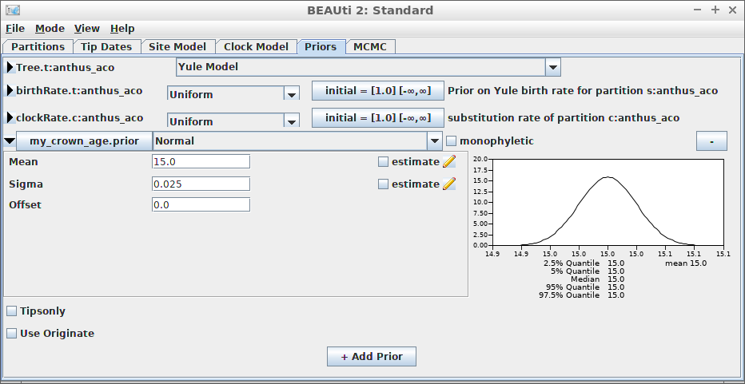
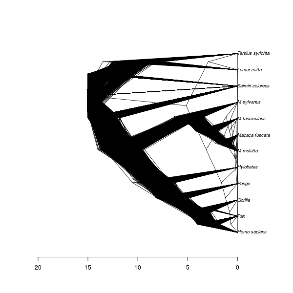

# babette_example_2

Branch   |[](https://travis-ci.org)                                                                                           |[](https://appveyor.com)                                                                                               
---------|--------------------------------------------------------------------------------------------------------------------------------------------------------|--------------------------------------------------------------------------------------------------------------------------------------------------------------------------------------------
`master` |[](https://travis-ci.org/richelbilderbeek/babette_example_2) |[](https://ci.appveyor.com/project/richelbilderbeek/babette-example-2/branch/master)
`develop`|[](https://travis-ci.org/richelbilderbeek/babette_example_2)|[](https://ci.appveyor.com/project/richelbilderbeek/babette-example-2/branch/develop)

A [babette example](https://github.com/richelbilderbeek/babette_examples).

## Example #2: fixed crown age

The way to do so, is to date the node of the most recent common ancestor
of all taxa:



```{r}
# Create a FASTA file
fasta_filename <- "primates.fas"
save_nexus_as_fasta(
  nexus_filename = beastier::get_beast2_example_filename("Primates.nex"),
  fasta_filename = fasta_filename
)

inference_results <- bbt_run(
  fasta_filename = fasta_filename
  mrca_prior = create_mrca_prior(
    taxa_names = get_taxa_names(fasta_filename),
    alignment_id = get_alignment_id(fasta_filename),
    is_monophyletic = TRUE,
    mrca_distr = create_normal_distr(
      mean = 15.0,
      sigma = 0.025
    )
  )
)
```

Here we use an MRCA prior with fixed (non-estimated) values of the mean
and standard deviation for the common ancestor node's time.

## Result


